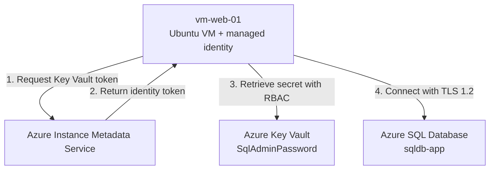
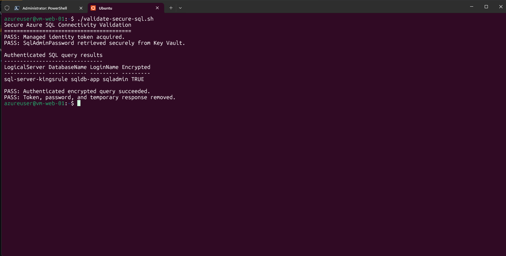
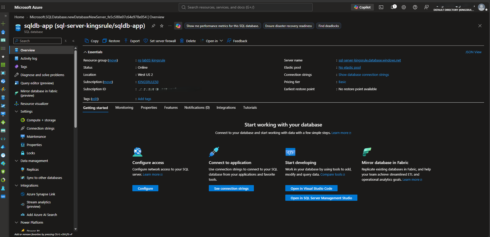
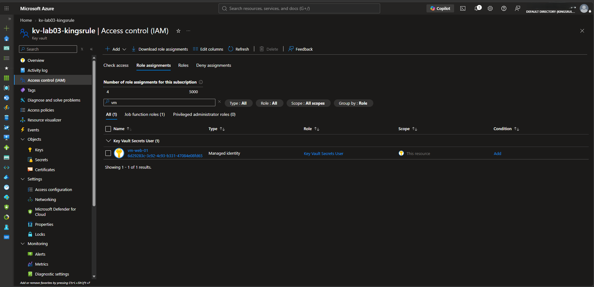
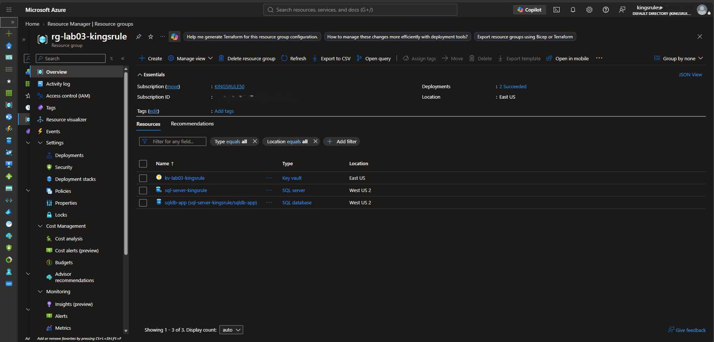

# Azure SQL, Key Vault, and Managed Identity Lab

This hands-on Azure portfolio lab modernizes a two-tier application by replacing an IaaS database virtual machine with Azure SQL Database. It secures the SQL administrator password in Azure Key Vault and lets the existing web VM retrieve that secret through a system-assigned managed identity and least-privilege Azure RBAC.

## Project outcomes

- Replaced a database VM with a managed Azure SQL Database.
- Deployed the database on the low-cost Basic tier with 5 DTUs.
- Restricted SQL public access to selected networks and required TLS 1.2.
- Stored the SQL administrator password in Azure Key Vault without exposing its value.
- Enabled a system-assigned managed identity on `vm-web-01`.
- Granted the VM only the `Key Vault Secrets User` role at the vault scope.
- Retrieved the secret at runtime without hardcoding credentials.
- Completed an authenticated SQL query over an encrypted connection.
- Reviewed Azure SQL DTU utilization in Azure Monitor.
- Removed the token, password variable, and temporary Key Vault response after validation.

## Architecture



The managed identity authenticates the VM to **Key Vault**. The SQL connection then uses SQL authentication with the password retrieved into memory. This lab does not claim that the managed identity authenticates directly to Azure SQL.

See [Architecture and security design](docs/architecture.md) for the complete flow and production improvements.

## Azure resources

| Component | Purpose | Lab location |
|---|---|---|
| `vm-web-01` | Existing Ubuntu web VM retained from Lab 02 | East US |
| `sqldb-app` | Managed application database | West US 2 |
| `sql-server-kingsrule` | Azure SQL logical server | West US 2 |
| `kv-lab03-kingsrule` | Stores `SqlAdminPassword` | East US |
| System-assigned identity | Authenticates `vm-web-01` to Key Vault | Microsoft Entra ID |

Azure SQL was deployed in West US 2 because the subscription did not permit the deployment in East US during the lab. Resource availability can differ by subscription.

## Security controls demonstrated

| Control | Implementation |
|---|---|
| Secret storage | SQL password stored in Azure Key Vault |
| Workload authentication | System-assigned VM managed identity |
| Least privilege | `Key Vault Secrets User` at the Key Vault resource scope |
| Administrative access | User assigned `Key Vault Administrator` at the vault scope |
| Encryption in transit | Azure SQL minimum TLS version set to 1.2; `sqlcmd -N` used |
| Network restriction | SQL public access limited to selected networks for the lab |
| Sensitive-data handling | Password and token are never printed and are removed after use |
| Monitoring | Azure Monitor DTU percentage with Max aggregation |

## Validation result

The validation script obtained a Key Vault token through the VM managed identity, retrieved the password without displaying it, connected to Azure SQL, and verified that the active SQL session was encrypted.



## Key evidence

### Azure SQL Database deployed



### Least-privilege access for the VM



### Final Lab 03 resources



The complete screenshot set and descriptions are in the [evidence index](docs/evidence-index.md).

## Documentation

- [Student guide in Markdown](docs/student-guide.md)
- [Downloadable Microsoft Word student guide](docs/Lab-03-Modernizing-to-Azure-SQL-and-Securing-Secrets-Student-Guide.docx)
- [Architecture and security design](docs/architecture.md)
- [Evidence index](docs/evidence-index.md)
- [Security policy and safe-use guidance](SECURITY.md)

## Repository structure

```text
.
|-- README.md
|-- SECURITY.md
|-- docs/
|   |-- architecture.md
|   |-- evidence-index.md
|   |-- student-guide.md
|   `-- Lab-03-Modernizing-to-Azure-SQL-and-Securing-Secrets-Student-Guide.docx
|-- screenshots/
`-- scripts/
    `-- validate-secure-sql.sh
```

## Run the validation script

The script is intended to run on the Azure VM after the resources, managed identity, RBAC role, SQL firewall, and `sqlcmd` have been configured.

```bash
chmod 700 scripts/validate-secure-sql.sh
./scripts/validate-secure-sql.sh
```

To reuse different resource names, set environment variables before running it:

```bash
export KEY_VAULT_NAME="<your-key-vault-name>"
export SQL_SERVER="<your-server-name>.database.windows.net"
export SQL_DATABASE="<your-database-name>"
export SQL_USERNAME="<your-sql-admin-login>"
./scripts/validate-secure-sql.sh
```

The script never asks for or stores the SQL password in the repository. It retrieves the value directly from Key Vault at runtime.

## Production improvements

This is a temporary training lab. A production design should normally add:

- Private endpoints for Azure SQL and Key Vault.
- Microsoft Entra authentication for Azure SQL instead of a SQL administrator password.
- Key Vault purge protection and carefully scoped network access.
- Diagnostic settings, centralized logging, alerts, and audited access reviews.
- Infrastructure as Code, policy enforcement, backup requirements, and a tested recovery plan.

## Cleanup

The Lab 03 and Lab 02 resource groups were deleted after the screenshots and documentation were completed. Deleting `vm-web-01` also removed its system-assigned identity, and deleting the Key Vault removed the resource-scoped role assignments.

## Author

**Chinedu K. Asuzu**
Azure Cloud Engineering and Security portfolio project

> This repository is an educational lab. Names, regions, and example configurations should be adapted to the requirements of your own Azure environment.
