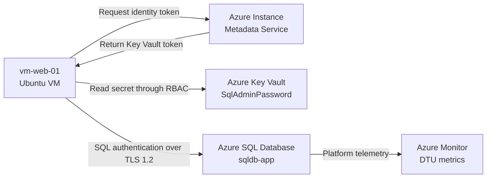
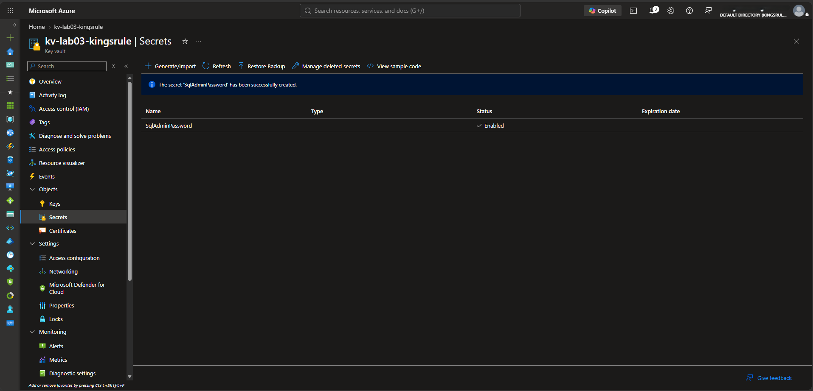
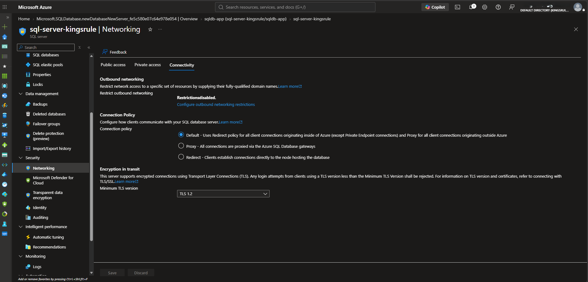
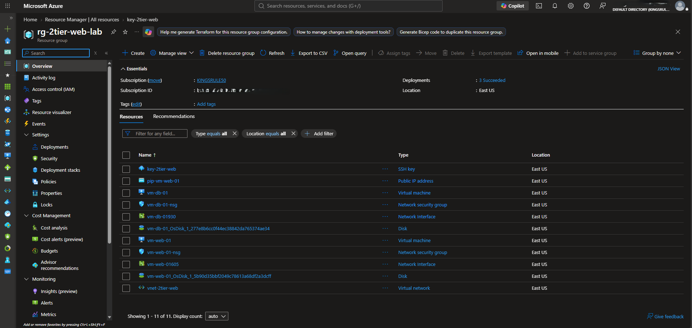
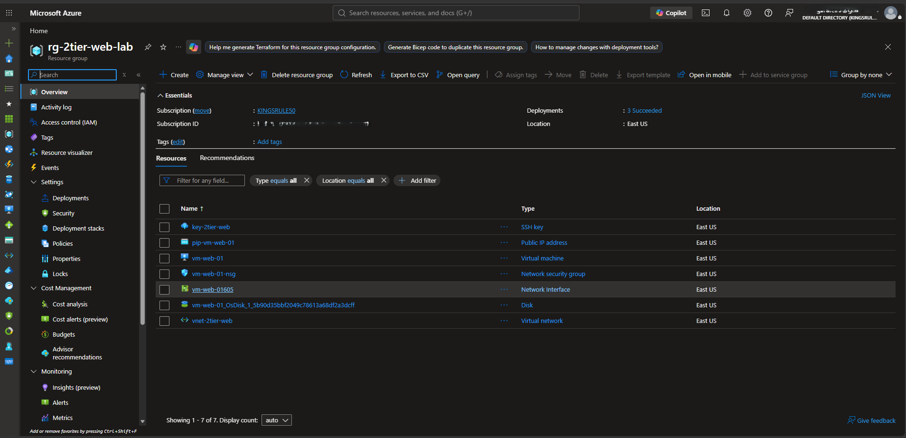
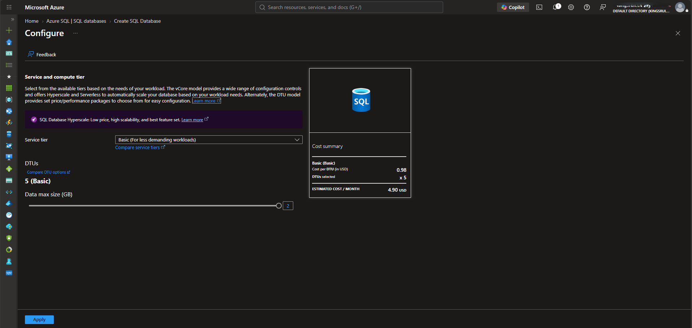
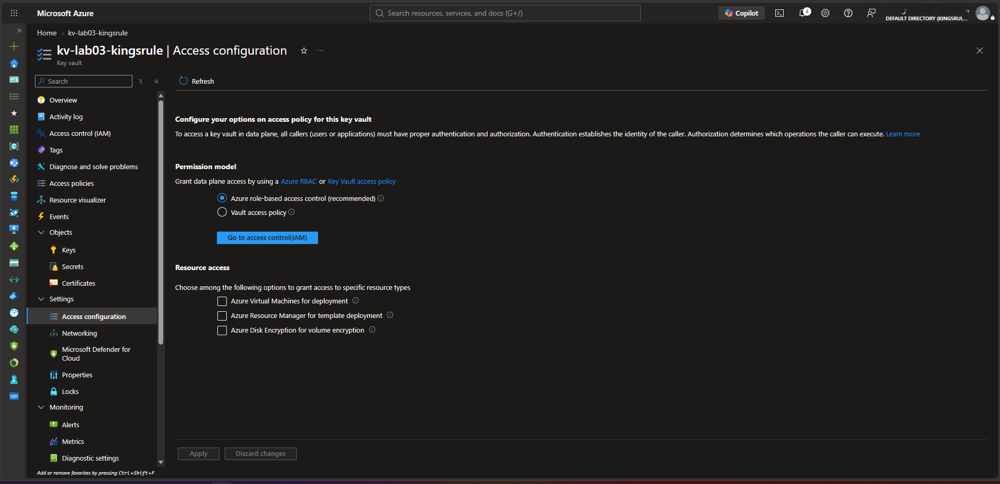
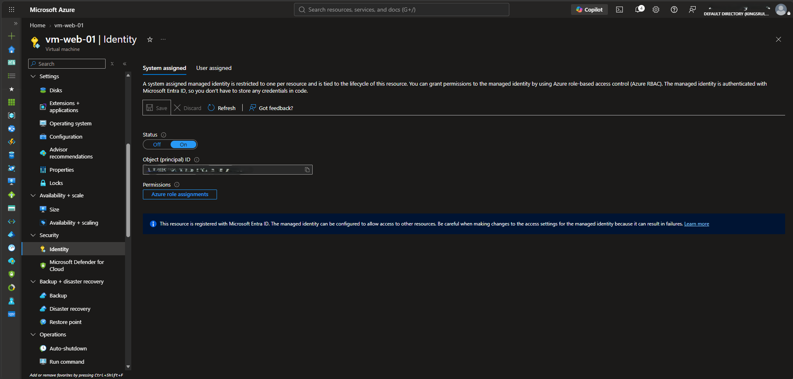
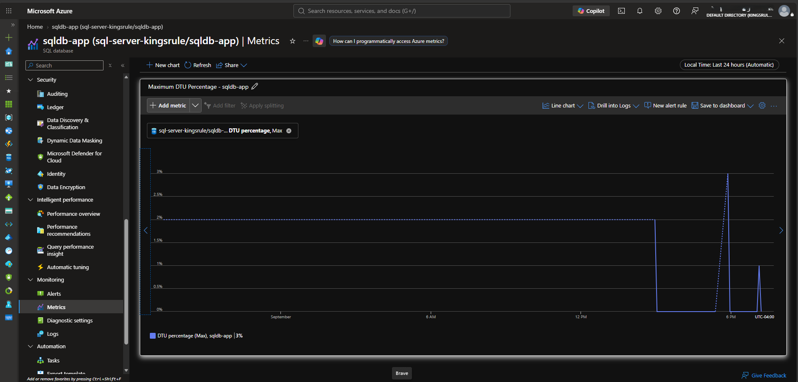

# Azure SQL Modernization with Key Vault and Managed Identity

[](https://azure.microsoft.com/)
[](https://azure.microsoft.com/products/azure-sql/database)
[](https://azure.microsoft.com/products/key-vault)
[](https://www.gnu.org/software/bash/)

An Azure cloud engineering and security portfolio project that modernizes a two-tier application by retiring an IaaS database virtual machine and replacing it with Azure SQL Database. The solution moves the SQL administrator password into Azure Key Vault and uses a system-assigned managed identity, resource-scoped RBAC, TLS 1.2, and secure runtime validation.

This project extends the [Azure Secure 2-Tier Web Application Lab](https://github.com/kingsrule50/azure-secure-2tier-web-app-lab) and demonstrates a practical migration from VM-hosted infrastructure to a managed database service.

## Executive Summary

| Before | After |
|---|---|
| Database workload represented by `vm-db-01` | Managed database hosted in Azure SQL Database |
| Additional VM, NIC, NSG, disk, and operating-system administration | Microsoft-managed database platform |
| Application credentials vulnerable to being stored in scripts or configuration | SQL password stored in Azure Key Vault |
| Static workload credentials required to access the vault | VM system-assigned managed identity |
| Limited database-service telemetry | DTU utilization reviewed through Azure Monitor |

The final design reduces infrastructure-management overhead, centralizes secret storage, limits Key Vault access through least-privilege RBAC, enforces encrypted SQL connectivity, and produces repeatable validation evidence.

## Architecture



The managed identity authenticates `vm-web-01` to **Azure Key Vault**. The database session uses SQL authentication with the password retrieved securely at runtime. These are separate authentication steps; the project does not claim that the managed identity signs in directly to Azure SQL.

See the [architecture and security design](docs/architecture.md) for the detailed runtime flow and production target state.

## Azure Resources

| Resource | Name / Configuration | Purpose |
|---|---|---|
| Existing web VM | `vm-web-01` — Ubuntu 24.04 LTS | Application tier and validation host |
| Azure SQL logical server | `sql-server-kingsrule` | Hosts the managed SQL database |
| Azure SQL Database | `sqldb-app` — Basic, 5 DTUs | Managed application database |
| Azure Key Vault | `kv-lab03-kingsrule` — Standard | Stores `SqlAdminPassword` |
| System-assigned identity | Attached to `vm-web-01` | Passwordless VM authentication to Key Vault |
| Azure RBAC assignment | `Key Vault Secrets User` at vault scope | Grants the VM read-only secret access |
| Azure Monitor metric | DTU percentage, Max aggregation | Confirms database resource utilization |

Azure SQL was deployed in West US 2 because the project subscription did not permit that deployment in East US at the time. The web VM and Key Vault were hosted in East US.

## Security Design

### Managed Identity and Least Privilege

- Enabled a system-assigned managed identity on `vm-web-01`.
- Granted the identity only `Key Vault Secrets User` at the Key Vault resource scope.
- Used `Key Vault Administrator` only for the human administrator who created and managed the secret.
- Avoided service-principal client secrets and long-lived credentials for Key Vault access.


### Secret Management

- Stored the SQL administrator password as the `SqlAdminPassword` Key Vault secret.
- Retrieved the secret at runtime through an OAuth token issued for the VM identity.
- Prevented the secret value, access token, and connection string from appearing in the repository or screenshots.
- Passed the password to `sqlcmd` through `SQLCMDPASSWORD` instead of a command-line argument.
- Removed the password variable, token, and temporary Key Vault response when validation completed.



### Network and Transport Security

- Limited Azure SQL public access to selected networks for the project.
- Configured a temporary workstation firewall rule only for required administration.
- Required a minimum of TLS 1.2 on the Azure SQL logical server.
- Requested encrypted connectivity with `sqlcmd -N` and verified the live session reported `Encrypted = TRUE`.



## Implementation Summary

1. Captured the original two-tier environment and removed the database VM and its dependent resources.
2. Retained `vm-web-01` as the application and validation host.
3. Deployed `sqldb-app` on Azure SQL Database using the Basic 5-DTU tier.
4. Restricted SQL network access and required TLS 1.2.
5. Deployed Azure Key Vault with Azure RBAC authorization.
6. Created `SqlAdminPassword` without displaying its value.
7. Enabled the web VM's system-assigned managed identity.
8. Assigned `Key Vault Secrets User` to the VM identity at the vault scope.
9. Ran a Bash validation workflow from the VM to obtain a token, retrieve the secret, connect to SQL, verify encryption, and clean up sensitive variables.
10. Reviewed Azure SQL DTU percentage in Azure Monitor and captured final deployment evidence.

## Validation

The validation workflow completed all of the following successfully:

- Acquired a managed identity token for Azure Key Vault.
- Retrieved `SqlAdminPassword` without printing its value.
- Connected to `sqldb-app` using SQL authentication.
- Returned the expected logical server, database, and login context.
- Confirmed the active SQL session was encrypted.
- Removed sensitive variables and the temporary Key Vault response.


## Deployment Evidence

### Database VM Decommissioning

The original architecture contained both web and database VMs. After modernization, the web tier remained while the database VM and its dependent infrastructure were removed.





### Azure SQL Database

The managed database was deployed on the Basic tier and confirmed online.




### Key Vault and Workload Identity

Azure RBAC was selected as the Key Vault permission model, and the web VM received a system-assigned identity for workload authentication.





### Monitoring and Final State

Azure Monitor displayed database DTU utilization, and the final resource group contained the Key Vault, SQL logical server, and SQL database.




## What This Project Demonstrates

- Azure application and database modernization
- IaaS-to-PaaS migration decision-making
- Azure SQL Database deployment and administration
- Azure Key Vault secret lifecycle management
- Microsoft Entra workload identities
- Azure RBAC and resource-scoped least privilege
- Secure credential retrieval without hardcoding secrets
- TLS configuration and encrypted-session verification
- Bash automation and defensive secret handling
- Azure Monitor performance metrics
- Azure resource lifecycle and cost-conscious cleanup
- Security evidence review and redaction before publication

## Career Relevance

| Target Role | Demonstrated Capability |
|---|---|
| Azure Cloud Engineer / Administrator | Modernized a VM-based database tier, deployed Azure SQL, configured networking, and monitored service utilization |
| Cloud Security Engineer | Implemented Key Vault, workload identity, least-privilege RBAC, TLS enforcement, and secure secret handling |
| Identity and Access Management Engineer | Used Microsoft Entra managed identity and resource-scoped role assignments for workload access |
| DevOps / Platform Engineer | Built a reusable Bash validation workflow with environment-based configuration and cleanup controls |
| Security or Compliance Analyst | Documented security controls, verified encryption, preserved evidence, and removed sensitive identifiers before publication |

## Scope

This is a hands-on portfolio implementation completed in a temporary Azure environment. It demonstrates the modernization and security controls but is not presented as a production-ready reference architecture.

The project deliberately uses a SQL administrator password retrieved from Key Vault to demonstrate managed secret access. A stronger target state would use Microsoft Entra authentication directly with Azure SQL and eliminate the SQL password where application requirements permit.

## Repository Structure

```text
azure-sql-key-vault-managed-identity-lab/
├── README.md
├── SECURITY.md
├── docs/
│   └── architecture.md
├── screenshots/
│   └── Azure portal and validation evidence
└── scripts/
    └── validate-secure-sql.sh
```

## Validation Script

Run the script from the Azure VM after the managed identity, Key Vault RBAC assignment, SQL firewall, and `sqlcmd` have been configured:

```bash
chmod 700 scripts/validate-secure-sql.sh
./scripts/validate-secure-sql.sh
```

To reuse different resource names, set the environment variables before execution:

```bash
export KEY_VAULT_NAME="<your-key-vault-name>"
export SQL_SERVER="<your-server-name>.database.windows.net"
export SQL_DATABASE="<your-database-name>"
export SQL_USERNAME="<your-sql-admin-login>"
./scripts/validate-secure-sql.sh
```

The password is retrieved directly from Key Vault at runtime and is not stored in the repository.

## Production Improvements

- Use private endpoints and private DNS for Azure SQL and Key Vault.
- Replace SQL authentication with Microsoft Entra authentication where supported.
- Enable Key Vault purge protection and restrict Key Vault network access.
- Send diagnostic settings to Log Analytics and configure actionable alerts.
- Deploy the architecture through Terraform or Bicep with CI/CD controls.
- Add Azure Policy, tagging standards, resource locks, budgets, and access reviews.
- Define backup retention, recovery objectives, and tested restoration procedures.

## Related Project

[Azure Secure 2-Tier Web Application Lab](https://github.com/kingsrule50/azure-secure-2tier-web-app-lab) — the original segmented IaaS environment with a public web tier and private database tier.

## Key Takeaway

This project demonstrates how Azure managed services and workload identity can reduce infrastructure overhead and credential exposure at the same time. The web VM authenticates to Key Vault without an embedded vault credential, receives only the permission required to read the database secret, and proves that the resulting Azure SQL session is encrypted.

## Author

**Chinedu K. Asuzu** | Azure Cloud & Security Professional

[GitHub](https://github.com/kingsrule50) | [LinkedIn](https://www.linkedin.com/in/chinedu-asuzu-cisa)

Certifications: CISA | CompTIA Security+ | Microsoft SC-401
