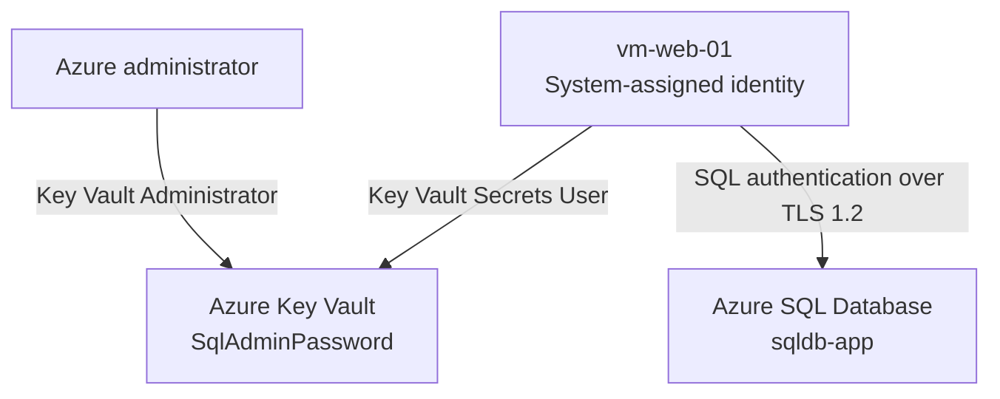

# Architecture and Security Design

## Modernization Objective

The project replaces the database tier of a two-VM Azure application with Azure SQL Database while retaining the existing Ubuntu web VM. The SQL administrator password is removed from scripts and configuration files and stored in Azure Key Vault.

## Runtime Security Flow

1. `vm-web-01` requests an OAuth token from Azure Instance Metadata Service for the Key Vault resource.
2. Microsoft Entra ID issues the token for the VM's system-assigned identity.
3. The VM presents that token to Key Vault.
4. Azure RBAC authorizes the identity through the `Key Vault Secrets User` role.
5. Key Vault returns `SqlAdminPassword` to the validation process.
6. The script holds the password only in `SQLCMDPASSWORD` and opens an encrypted Azure SQL connection.
7. A query checks `sys.dm_exec_connections.encrypt_option` and returns `TRUE`.
8. The exit trap removes the token, password variable, and temporary Key Vault response.

## Identity and Access Model

| Principal | Role | Scope | Purpose |
|---|---|---|---|
| Project administrator | `Key Vault Administrator` | Key Vault resource | Create and manage the secret |
| `vm-web-01` managed identity | `Key Vault Secrets User` | Key Vault resource | Read secret values without managing the vault |

The workload identity is deliberately not assigned `Key Vault Administrator`. This separation demonstrates least privilege and reduces the impact of a compromised workload.

## Network Design

The implemented environment used:

- Azure SQL public endpoint enabled.
- Public access limited to selected networks.
- A temporary workstation firewall rule where required.
- The Azure-services exception enabled so the Azure VM could reach the SQL endpoint.
- Default Azure SQL connection policy.
- Minimum TLS version set to TLS 1.2.

The public endpoint and Azure-services exception simplified the temporary implementation. The exception is broad and is not presented as the preferred production design.

## Sensitive-Data Handling

| Data | Storage or Handling Method |
|---|---|
| SQL password | Stored as the `SqlAdminPassword` Key Vault secret |
| Managed identity token | Held only in a shell variable during execution |
| Key Vault response | Written to a temporary file created under `umask 077` and deleted on exit |
| SQL password at runtime | Passed through `SQLCMDPASSWORD`, not a command-line argument |
| Evidence screenshots | Reviewed and redacted before publication |

## Regional Placement

`vm-web-01` and Key Vault were deployed in East US. Azure SQL was deployed in West US 2 because the subscription did not permit the SQL deployment in East US at the time. This was acceptable for the temporary project but would require deliberate latency, resilience, data-residency, and cost analysis in production.

## Production Target State

1. Private endpoints and private DNS for Azure SQL and Key Vault.
2. Microsoft Entra authentication for Azure SQL, eliminating the SQL password where possible.
3. Key Vault purge protection and restricted public network access.
4. Diagnostic settings sent to Log Analytics with alerts and retention requirements.
5. Azure Policy, resource locks, tagging, budgets, and formal access reviews.
6. Automated deployment through Terraform or Bicep and a controlled CI/CD pipeline.
7. Defined backup retention, recovery objectives, and tested restoration procedures.

## Authentication Boundary

The VM's managed identity authenticates to **Azure Key Vault**. The database session shown in the project evidence uses the `sqladmin` SQL login with a password obtained from Key Vault. These are two distinct authentication steps.
