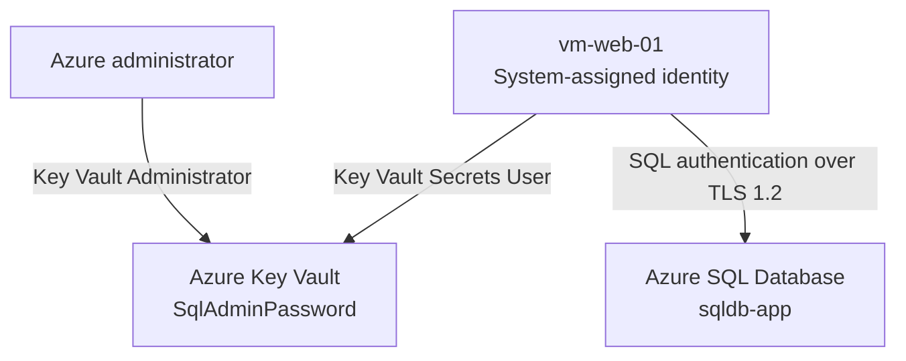

# Architecture and Security Design

## Design goal

The lab replaces the database tier of a two-VM application with Azure SQL Database while keeping the existing Ubuntu web VM. The SQL administrator password is moved out of scripts and configuration files into Azure Key Vault.

## Runtime security flow

1. `vm-web-01` requests an OAuth token from Azure Instance Metadata Service for the Key Vault resource.
2. Microsoft Entra ID issues the token for the VM's system-assigned identity.
3. The VM presents the token to Key Vault.
4. Azure RBAC authorizes the identity through the `Key Vault Secrets User` role.
5. Key Vault returns `SqlAdminPassword` to the validation process.
6. The script exports the password only as `SQLCMDPASSWORD` and opens an encrypted connection to Azure SQL.
7. A query checks `sys.dm_exec_connections.encrypt_option` and returns `TRUE`.
8. The exit trap removes the token, password variables, and temporary Key Vault response.

## Identity and access model

| Principal | Role | Scope | Reason |
|---|---|---|---|
| Lab administrator | `Key Vault Administrator` | Key Vault resource | Create and manage the lab secret |
| `vm-web-01` managed identity | `Key Vault Secrets User` | Key Vault resource | Read secret values without managing the vault |

The VM is deliberately not assigned `Key Vault Administrator`. This separation demonstrates least privilege.

## Network design

The completed training environment used:

- Azure SQL public endpoint enabled.
- Public access limited to selected networks.
- A temporary workstation firewall rule where required.
- The Azure-services exception enabled so the Azure VM could reach the SQL endpoint.
- Default Azure SQL connection policy.
- Minimum TLS version set to TLS 1.2.

The public endpoint and Azure-services exception simplified a short-lived student lab. The exception is broad and is not presented as the preferred production design.

## Data handling

| Data | Storage or handling method |
|---|---|
| SQL password | Stored as the `SqlAdminPassword` Key Vault secret |
| Managed identity token | Held only in a shell variable during execution |
| Key Vault response | Temporary file created under `umask 077` and deleted on exit |
| SQL password at runtime | Passed through `SQLCMDPASSWORD`, not a command-line argument |
| Evidence screenshots | Reviewed and redacted before publication |

## Regional placement

`vm-web-01` and Key Vault were deployed in East US. Azure SQL was deployed in West US 2 because the subscription did not allow the SQL deployment in East US at the time of the lab. This is acceptable for demonstration but adds latency and would require a deliberate design decision in production.

## Production target state

A stronger production version would use:

1. Private endpoints and private DNS for Azure SQL and Key Vault.
2. Microsoft Entra authentication for Azure SQL, ideally eliminating the SQL password.
3. Key Vault purge protection and restricted public network access.
4. Diagnostic settings sent to Log Analytics or another centralized destination.
5. Azure Policy, resource locks, tagging, budgets, alerts, and formal access reviews.
6. Automated deployment through Bicep or Terraform and a controlled CI/CD pipeline.
7. Backup, retention, recovery objectives, and tested restoration procedures.

## Important interpretation

The VM's managed identity authenticates to **Key Vault**. The database session shown in the evidence uses the `sqladmin` SQL login with a password obtained from Key Vault. These are two distinct authentication steps.
